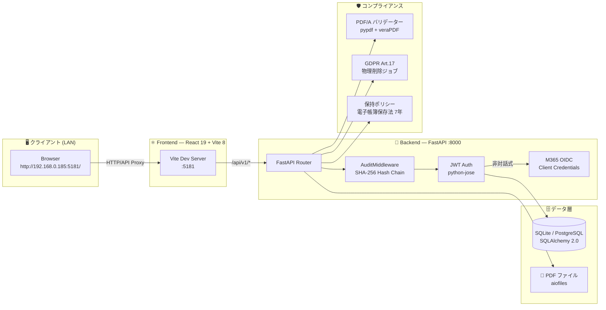

# CivilPDF-DX

**現場が止まらない PDF 管理を。建設・土木業務に特化したオープンソース PDF プラットフォーム。**

[](https://github.com/Kensan196948G/CivilPDF-DX/actions/workflows/ci.yml)
[](https://www.python.org/)
[](https://nodejs.org/)
[](https://react.dev/)
[](https://fastapi.tiangolo.com/)
[](https://opensource.org/licenses/MIT)
[](https://claude.ai)

---

## 📌 概要

CivilPDF-DX は、**建設・土木業における PDF 業務を一気通貫で管理するプラットフォーム**です。
JWT 認証・M365 統合・多段階承認ワークフロー・PDF/A バリデーション・GDPR 対応プライバシー管理・ISO 19650 メタデータ管理・改ざん検知付き監査チェーンを LAN 上のブラウザから即座に利用できます。

対象規模は**中堅〜大手ゼネコン・サブコン（従業員 50〜5,000 名）**。  
Phase 5.1 コンプライアンス基盤 + Phase 6 フロントエンドテスト強化 + プロフィール管理 API まで実装済み。バックエンドテスト 164 件・E2E テスト 20 件・フロントエンドテスト 103 件（計 287 件）、CI カバレッジ 98%。

---

## 🏗️ アーキテクチャ図



---

## ✨ 機能一覧

| カテゴリ | 機能 | 詳細 | 状態 |
|---|---|---|---|
| 🔐 **認証** | JWT 認証 | access / refresh token、自動更新 | ✅ |
| 🔐 **認証** | M365 OIDC 統合 | Client Credentials Flow（非対話式）、Fernet 暗号化保存 | ✅ |
| 👥 **ユーザー管理** | RBAC | admin / manager / engineer / viewer の 4 ロール | ✅ |
| 👥 **ユーザー管理** | AD ルックアップ | Azure AD ユーザー検索・同期 | ✅ |
| 📄 **文書管理** | PDF アップロード | 最大 50MB、種別分類・ステータス管理・検索フィルタ | ✅ |
| 📄 **文書管理** | PDF プレビュー | Blob URL + iframe、JWT 保護、Escape/×クローズ | ✅ |
| 📄 **文書管理** | PDF/A バリデーション | ISO 14289 準拠チェック（pypdf + veraPDF フォールバック） | ✅ |
| 📄 **文書管理** | ISO 19650 メタデータ | 文書種別・プロジェクト情報・改訂番号の入力 UI | ✅ |
| ✅ **承認ワークフロー** | 多段階承認 | ステップ単位の承認 / 却下 / コメント、RBAC 制御 | ✅ |
| 🛡️ **プライバシー** | GDPR Art.17 削除 | 論理削除マーク → 物理削除バッチジョブ | ✅ |
| 🛡️ **プライバシー** | 同意管理 | 同意記録モデル（ConsentRecord）、CCPA 対応 | ✅ |
| 📋 **保持ポリシー** | 電子帳簿保存法 7 年 | 書類種別別保持期間（税務/建設/公共工事/電子納品/個人情報等） | ✅ |
| 🔍 **監査** | 監査ログ | 全操作の証跡（閲覧・DL・署名・拒否）、フィルタ・検索対応 | ✅ |
| 🔍 **監査** | 監査チェーン | SHA-256 ハッシュチェーン、改ざん検知エンドポイント | ✅ |
| 📊 **統計** | ダッシュボード | 文書数・承認待ち・アクティブユーザー・月次承認数リアルタイム集計 | ✅ |
| 🔍 **OCR** | テキスト抽出 | PDF テキスト抽出 API（基盤実装済み） | ✅ |

---

## 🚀 セットアップ手順

### 📋 前提条件

| ツール | バージョン |
|---|---|
| Python | 3.12 以上 |
| Node.js | 20.x 以上（CI は 24.x） |
| SQLite（開発） または PostgreSQL（本番） | 15 以上 |

---

### 🐍 Backend（FastAPI）

```bash
cd src/console/backend

# 1. 仮想環境
python -m venv .venv
source .venv/bin/activate          # Windows: .venv\Scripts\activate

# 2. 依存インストール
pip install -r requirements.txt
pip install -r requirements-dev.txt   # テスト用（pytest 等）

# 3. 環境変数
cp .env.example .env
# .env を編集: DATABASE_URL / SECRET_KEY / M365 設定 など

# 4. 起動（lifespan でテーブル自動作成）
PYTHONPATH=src/console/backend uvicorn main:app --reload --port 8000
```

**初回管理者ユーザー作成:**

```bash
PYTHONPATH=src/console/backend python scripts/create_admin.py
# admin@example.com / AdminPass123! で作成
```

---

### ⚛️ Frontend（React + Vite）

```bash
cd src/console/frontend

npm install
npm run dev         # http://localhost:5173（デフォルト）
npm run dev:lan     # http://0.0.0.0:5181（LAN 公開）

# 本番ビルド
npm run build
```

> `vite.config.ts` の API プロキシはデフォルトで `http://localhost:8000` を向いています。

---

### 🖥️ systemd 登録（LAN アクセス用）

```bash
# インストールスクリプト
bash deploy/install-systemd.sh

# サービス確認
systemctl --user status civilpdf-frontend.service
systemctl --user status civilpdf-backend.service

# LAN アクセス URL
open http://192.168.0.185:5181/
```

| サービス | ポート | 説明 |
|---|---|---|
| `civilpdf-backend.service` | 8000 | FastAPI（uvicorn） |
| `civilpdf-frontend.service` | 5181 | Vite dev:lan（LAN 公開） |

> `loginctl enable-linger $USER` でログアウト後も常駐起動。

---

## 🧪 テスト

| スイート | テスト数 | カバレッジ | 実行コマンド |
|---|---|---|---|
| Backend ユニットテスト | 164 件 | 98% | `pytest tests/console/ -v` |
| Backend E2E 統合テスト | 20 件 | — | `pytest tests/integration/ -v` |
| Frontend（Vitest） | 103 件 | — | `cd src/console/frontend && npx vitest run` |
| **合計** | **287 件** | — | — |

```bash
# バックエンド（SQLite in-memory、DB 不要）
export DATABASE_URL=sqlite:///./test_ci.db
export PYTHONPATH=src/console/backend

# スイート別実行
.venv/bin/python -m pytest tests/console/ -v --tb=short      # ユニットテスト 164 件
.venv/bin/python -m pytest tests/integration/ -v --tb=short  # E2E テスト 20 件

# 全スイート一括実行（interference なし）
.venv/bin/python -m pytest tests/ -v --tb=short              # 計 184 件

# フロントエンド
cd src/console/frontend
npm run lint
npm run build
npx vitest run
```

### CI ゲート（GitHub Actions）

| ジョブ | 内容 |
|---|---|
| `backend-lint` | ruff check + ruff format --check |
| `backend-test` | pytest 164 件（SQLite in-memory、カバレッジ 98%） |
| `backend-security` | pip-audit 依存脆弱性スキャン |
| `frontend-lint-test` | ESLint 0 errors + TypeScript build (Vite) |
| `integration-test` | E2E テスト 20 件（認証 / 文書 / 承認 / GDPR / RBAC） |

---

## 📁 ディレクトリ構造

```
CivilPDF-DX/
├── src/
│   └── console/
│       ├── backend/                  # FastAPI バックエンド
│       │   ├── api/                  # REST エンドポイント
│       │   │   ├── auth.py           # 🔐 JWT 認証
│       │   │   ├── users.py          # 👥 ユーザー管理
│       │   │   ├── documents.py      # 📄 文書管理 + PDF/A
│       │   │   ├── workflows.py      # ✅ 承認ワークフロー
│       │   │   ├── projects.py       # 📁 プロジェクト管理
│       │   │   ├── audit_logs.py     # 🔍 監査ログ + チェーン検証
│       │   │   ├── stats.py          # 📊 統計集計
│       │   │   ├── m365.py           # ⚙️ M365 テナント設定
│       │   │   ├── privacy.py        # 🛡️ GDPR Art.17 プライバシー管理
│       │   │   └── ocr.py            # 🔤 OCR テキスト抽出
│       │   ├── models/               # SQLAlchemy ORM モデル
│       │   │   ├── user.py           # User（RBAC roles）
│       │   │   ├── document.py       # Document + ApprovalWorkflow
│       │   │   ├── audit_log.py      # AuditLog（SHA-256 hash chain）
│       │   │   ├── consent.py        # ConsentRecord（GDPR/CCPA）
│       │   │   ├── retention_policy.py  # RetentionPolicy（電子帳簿保存法）
│       │   │   └── m365_setting.py   # M365 Fernet 暗号化設定
│       │   ├── services/             # ドメインサービス
│       │   │   ├── pdfa_validator.py     # PDF/A ISO 14289 検証
│       │   │   ├── audit_chain_service.py # SHA-256 チェーン生成
│       │   │   ├── deletion_job.py    # GDPR 物理削除バッチ
│       │   │   ├── retention_service.py  # 保持ポリシー判定
│       │   │   └── m365.py           # Azure AD 統合
│       │   ├── middleware/
│       │   │   └── audit.py          # 🔒 全書き込み操作の自動監査
│       │   ├── auth/                 # JWT 認証・依存性注入
│       │   └── main.py               # FastAPI アプリ本体
│       │
│       └── frontend/                 # React フロントエンド
│           └── src/
│               ├── api/              # Axios クライアント（ドメイン別）
│               ├── components/
│               │   └── enterprise/views/   # 12 画面
│               │       ├── DashboardView.tsx
│               │       ├── DocumentsView.tsx
│               │       ├── UploadView.tsx   # ISO 19650 メタデータ入力
│               │       ├── WorkflowView.tsx
│               │       ├── AuditView.tsx
│               │       ├── PrivacyView.tsx  # GDPR Art.17 UI
│               │       ├── SecurityView.tsx
│               │       ├── M365View.tsx
│               │       └── ...
│               ├── store/            # Zustand 認証ストア
│               └── pages/            # ページコンポーネント
│
├── tests/
│   ├── console/                      # pytest ユニットテスト（164 件）
│   └── integration/                  # E2E 統合テスト（20 件）
│
├── deploy/
│   ├── civilpdf-backend.service      # systemd ユニット
│   ├── civilpdf-frontend.service
│   └── install-systemd.sh
│
├── docs/                             # 設計ドキュメント
├── .github/workflows/ci.yml          # CI: lint / test / security scan
└── docker-compose.yml
```

---

## 🔐 セキュリティ・RBAC

### ロール権限テーブル

| 操作 | 👤 admin | 👔 manager | 🔧 engineer | 👁️ viewer |
|---|:---:|:---:|:---:|:---:|
| ユーザー管理（CRUD） | ✅ | ❌ | ❌ | ❌ |
| M365 テナント設定 | ✅ | ❌ | ❌ | ❌ |
| GDPR 削除リクエスト実行 | ✅ | ❌ | ❌ | ❌ |
| 監査ログ閲覧 | ✅ | ✅ | ❌ | ❌ |
| 文書アップロード・削除 | ✅ | ✅ | ✅ | ❌ |
| 承認ワークフロー操作 | ✅ | ✅ | ✅ | ❌ |
| 文書・プロジェクト閲覧 | ✅ | ✅ | ✅ | ✅ |
| ダッシュボード閲覧 | ✅ | ✅ | ✅ | ✅ |

### セキュリティ機構

| 機能 | 実装 |
|---|---|
| パスワードハッシュ | bcrypt（passlib） |
| JWT 署名 | HS256（python-jose） |
| M365 資格情報 | Fernet 対称暗号化（cryptography 46.x） |
| 監査チェーン | SHA-256 hash chain（改ざん検知エンドポイント付き） |
| 依存脆弱性スキャン | pip-audit（CI で毎回実行） |
| CORS | FastAPI CORSMiddleware（オリジン制限） |

---

## 📋 API エンドポイント一覧

ベース URL: `http://<host>:8000/api/v1`

| カテゴリ | エンドポイント | メソッド | 説明 | 権限 |
|---|---|---|---|---|
| **認証** | `/auth/token` | POST | JWT トークン発行 | 全員 |
| **認証** | `/auth/refresh` | POST | トークン更新 | 認証済み |
| **ユーザー** | `/users/` | GET / POST | ユーザー一覧・作成 | admin |
| **ユーザー** | `/users/{id}` | PUT / DELETE | ユーザー更新・削除 | admin |
| **文書** | `/documents/` | GET / POST | 文書一覧・アップロード | 認証済み |
| **文書** | `/documents/{id}` | GET / PATCH / DELETE | 文書取得・更新・削除 | 認証済み |
| **文書** | `/documents/{id}/download` | GET | PDF ダウンロード（JWT 保護） | 認証済み |
| **文書** | `/documents/{id}/validate-pdfa` | POST | PDF/A バリデーション | 認証済み |
| **プロジェクト** | `/projects/` | GET / POST / PUT / DELETE | プロジェクト CRUD | 認証済み |
| **ワークフロー** | `/workflows/` | GET / POST | 承認フロー一覧・作成 | 認証済み |
| **ワークフロー** | `/workflows/{id}/steps/{step_id}/approve` | POST | 承認 | manager 以上 |
| **監査ログ** | `/audit-logs/` | GET | 監査証跡一覧（フィルタ対応） | admin / manager |
| **監査ログ** | `/audit-logs/verify` | GET | ハッシュチェーン整合性検証 | admin |
| **統計** | `/stats/` | GET | ダッシュボード集計 | 認証済み |
| **M365** | `/m365/config` | GET / PUT | テナント設定 | admin |
| **M365** | `/m365/users/lookup` | GET | AD ユーザー検索 | admin |
| **プライバシー** | `/privacy/gdpr/deletion-request` | POST | GDPR Art.17 削除リクエスト | admin |
| **プライバシー** | `/privacy/gdpr/consents` | GET / POST | 同意記録管理 | 認証済み |
| **プライバシー** | `/privacy/retention-policies` | GET / POST | 保持ポリシー管理 | admin |
| **OCR** | `/ocr/extract` | POST | PDF テキスト抽出 | 認証済み |

---

## 🔧 技術スタック

| レイヤー | 技術 | バージョン |
|---|---|---|
| **フロントエンド** | React + TypeScript | 19.x |
| **ビルドツール** | Vite | 8.x |
| **UI スタイル** | Tailwind CSS | v4 |
| **状態管理** | Zustand | v5 |
| **データフェッチ** | TanStack Query | v5 |
| **HTTP クライアント** | Axios | v1 |
| **ルーティング** | React Router | v7 |
| **バックエンド** | FastAPI (Python) | 0.115+ |
| **ORM** | SQLAlchemy | 2.0 |
| **スキーマ検証** | Pydantic | v2 |
| **DB マイグレーション** | Alembic | 最新 |
| **認証** | JWT（python-jose + passlib bcrypt） | — |
| **データベース** | SQLite（開発）/ PostgreSQL 15+（本番） | — |
| **PDF 処理** | pypdf + veraPDF | — |
| **暗号化** | cryptography（Fernet） | 46.x |
| **Lint / Format** | ruff | 0.8.6 |
| **テスト（Backend）** | pytest + httpx | — |
| **テスト（Frontend）** | Vitest | — |
| **CI/CD** | GitHub Actions | — |
| **コードレビュー** | CodeRabbit / Codex Review | — |

---

## 📊 ロードマップ

| フェーズ | 内容 | 状態 |
|---|---|---|
| Phase 1 | 管理コンソール MVP（JWT 認証・ユーザー・プロジェクト・文書・ワークフロー） | ✅ 完成 |
| Phase 2 | Alembic マイグレーション（ゼロダウンタイムスキーマ変更） | ✅ 完成 |
| Phase 3 | 監査ログ・統計 API・M365 統合・PDF プレビュー | ✅ 完成 |
| Phase 3.1 | フロントエンドテスト拡充（Dashboard / Documents / Workflows 等 52 件） | ✅ 完成 |
| Phase 4 | フロントエンド全画面 リアル API 接続（グレースフルフォールバック） | ✅ 完成 |
| **Phase 5.1** | **コンプライアンス基盤（PDF/A / GDPR Art.17 / ISO 19650 / 監査チェーン）** | ✅ **完成** |
| **Phase 6** | **フロントエンドテスト強化（Projects/Dashboard/Settings テスト、計 103 件）** | ✅ **完成** |
| **Phase 6.1** | **プロフィール更新 API（PATCH /auth/me・POST /auth/me/password）** | ✅ **完成** |
| Phase 7 | OCR・AI 統合（文書要約・自動分類・テキスト抽出） | 📋 未着手 |
| Phase 7 | 電子納品（国交省電子納品要領準拠 PDF/A 変換） | 📋 未着手 |

---

## 👩‍💻 開発ガイド（PR フロー）

```
1. Issue 作成（P1/P2/P3 で優先度付け）
      │
2. ブランチ作成
      git checkout -b feat/issue-XX-your-feature
      │
3. 実装 → テスト追加
      pytest tests/ -v
      ruff check src/ && ruff format src/
      cd src/console/frontend && npm run lint && npm run build
      │
4. PR 作成（CI 必須通過）
      - 変更内容・テスト結果・影響範囲・残課題を明記
      - CodeRabbit / Codex Review で指摘解消
      │
5. Approve → Merge → Deploy Gate
```

### ⚠️ 禁止事項

- `main` への直接 push
- CI 未通過の merge
- Issue なしの大規模変更
- セキュリティ関連変更の無レビューマージ

---

## 📚 ドキュメント

| 文書 | リンク | 内容 |
|---|---|---|
| 要件定義書 | [docs/requirements.md](docs/requirements.md) | 機能要件・非機能要件・受入れ基準 |
| DB 設計書 | [docs/database-design.md](docs/database-design.md) | ER 図・テーブル定義・インデックス |
| システム構成図 | [docs/architecture/system-architecture.md](docs/architecture/system-architecture.md) | 全体構成・認証フロー・デプロイ構成 |
| API リファレンス | [docs/api/README.md](docs/api/README.md) | REST エンドポイント詳細仕様 |
| WebUI 画面一覧 | [docs/webui-screens.md](docs/webui-screens.md) | 管理コンソール 12 画面仕様 |
| フォント一覧 | [docs/civilpdf-font-docs/fonts-README.md](docs/civilpdf-font-docs/fonts-README.md) | 3 層 16 書体・ダウンロード手順 |

---

## 🤝 コントリビューション

Issue 駆動開発を採用しています。変更前に Issue を作成し、ブランチを切ってください。  
詳細は [CONTRIBUTING.md](CONTRIBUTING.md) を参照してください。

## 🔒 セキュリティポリシー

脆弱性を発見した場合は [SECURITY.md](SECURITY.md) の手順に従って報告してください。

## 📄 ライセンス

[MIT License](LICENSE)

---

## 🤖 開発体制

このプロジェクトは [Claude Code](https://claude.ai) を主開発ツールとして使用し、
[CodeRabbit](https://coderabbit.ai) および Codex Review による AI コードレビューを導入しています。
