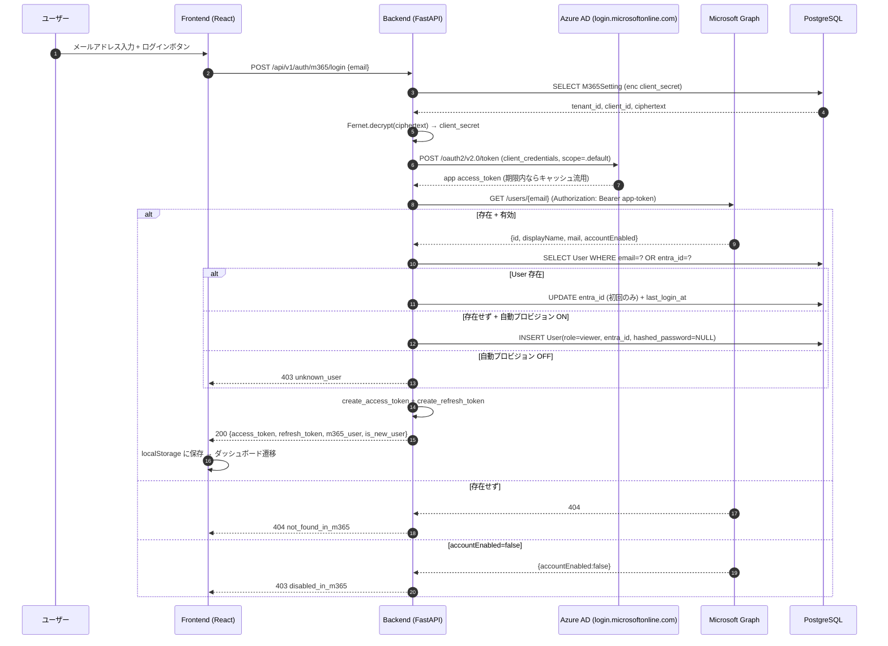

# 🔐 Microsoft 365 非対話式認証 統合設計書 — CivilPDF-DX

> **対象**: CivilPDF-DX に「一般 (パスワード) 認証」と「Microsoft 365 非対話式認証」の 2 系統ログインを提供するための設計
>
> **本書のステータス**: CTO 承認済 (実装着手 OK) / Codex 対抗レビュー 未実施
>
> **作成日**: 2026-05-15 / **更新日**: 2026-05-15 / **担当**: CTO + Architect
>
> **規格・規約**: CLAUDE.md §8 — 認証・認可変更は Codex 対抗レビュー必須

---

## 📌 1. 背景・目的

### 1.1 現状

- バックエンドは `OAuth2PasswordBearer` ベースの JWT 認証 (`src/console/backend/api/auth.py`)
- フロントエンド (`src/console/frontend/src/pages/Login.tsx`) は既に **2 タブ UI** (password / m365) を実装済
- 「M365 タブ」はメールアドレスのみ入力する**非対話式**フローを想定し、フロント API クライアント (`src/console/frontend/src/api/m365Auth.ts`) は `/auth/m365/login` を呼ぶ契約
- バックエンドの `src/console/backend/api/m365.py` は `prefix=/m365` のスタブで、Graph 呼び出し未実装

### 1.2 要件

| # | 要件 | 必須/任意 |
|---|---|---|
| R1 | 一般ログイン (DB のメール+パスワード) は従来通り維持 | 必須 |
| R2 | M365 ログインは**ユーザー操作を伴わない**形で完結する (パスワード入力なし) | 必須 |
| R3 | 認証成功後は CivilPDF-DX 独自 JWT を発行し、既存 RBAC をそのまま使う | 必須 |
| R4 | M365 のグループ/ロールは取り込まず、**DB のロール**を真実とする | 必須 |
| R5 | M365 未登録ユーザーは拒否、既知ユーザーで `status=inactive` のものは拒否 | 必須 |
| R6 | 初回 M365 ログイン時に `entra_id` を DB に紐付ける | 必須 |
| R7 | `client_secret` を平文で `.env` に置かない | 必須 |
| R8 | 管理 UI から接続テストできる | 必須 |
| R9 | 初回ユーザー自動プロビジョン (role=viewer 既定) | 任意 (フラグ制御) |

### 1.3 「非対話式」の定義 (重要)

CivilPDF-DX における「M365 非対話式認証」は、以下を意味する:

- **クライアント側にブラウザリダイレクトを発生させない**
- **ユーザーは M365 のパスワードを入力しない**
- フロントエンドは **メールアドレスのみ**を送信
- バックエンドが **Client Credentials Flow (アプリ専用フロー)** で Graph API を呼び、メールに該当する M365 ユーザーの実在性・有効性を確認する
- 認証成功 → CivilPDF-DX 側で JWT を発行 (ブリッジ)

> ⚠️ **本方式は IdP として M365 を「ユーザーディレクトリ」**として使う。「M365 でのパスワード検証」は M365 側では行われない。  
> 厳密な「OIDC 認可フロー」とは異なる点に注意 (§9.2 脅威モデル参照)。  
> 代替に **Device Code Flow / Auth Code with PKCE** があり、社内方針により切替可能 (§7 参照)。

---

## 📌 2. アーキテクチャ

### 2.1 全体フロー (mermaid)



### 2.2 コンポーネント構成

```
Frontend                            Backend
─────────────                       ────────────────────────────────
pages/Login.tsx                     api/auth.py
  └─ M365 tab                          ├─ POST /auth/token        (既存)
        └─ loginWithM365(email)        ├─ POST /auth/refresh      (既存)
                                       ├─ GET  /auth/me           (既存)
api/m365Auth.ts                        ├─ POST /auth/m365/login   (新規)
  ├─ loginWithM365                     └─ POST /auth/m365/test-connection (新規)
  ├─ testM365Connection
  ├─ getM365Config        ─────────► api/m365_config.py
  ├─ updateM365Config                  ├─ GET  /auth/m365/config
  └─ lookupM365User                    └─ PUT  /auth/m365/config
                                    
                                    auth/m365_provider.py         (新規)
                                       ├─ get_app_token (キャッシュ付)
                                       ├─ lookup_graph_user
                                       └─ test_connection
                                    
                                    services/m365_settings.py     (新規)
                                       ├─ load_settings (Fernet 復号)
                                       └─ save_settings (Fernet 暗号)
                                    
                                    models/m365_setting.py        (新規)
                                       └─ M365Setting テーブル
```

---

## 📌 3. 機密情報の保管

### 3.1 採用案: M365Setting テーブル + Fernet 暗号化

| 項目 | 保管先 | 暗号化 |
|---|---|---|
| tenant_id | DB `m365_settings.tenant_id` | 平文 |
| client_id | DB `m365_settings.client_id` | 平文 |
| client_secret | DB `m365_settings.client_secret_enc` | **Fernet** (URL-safe base64, AES-128-CBC + HMAC-SHA256) |
| Fernet key | OS 環境変数 `M365_FERNET_KEY` (デプロイ時に注入、ACL 制限) | — |
| キャッシュ済 app token | プロセスメモリ (`functools.lru_cache` + 期限) | — |

### 3.2 代替案検討

| 案 | 採否 | 理由 |
|---|---|---|
| `.env` に平文 | ✗ | R7 違反。リポジトリ流出リスク |
| OS Credential Manager (Windows DPAPI) | △ | Windows 限定。Linux 開発との同等性が崩れる。将来選択肢 |
| Azure Key Vault | ◎ (将来) | 推奨だがネット依存と料金が初期コスト。Phase 4 以降で検討 |
| **Fernet + DB** | ✓ 採用 | 開発/本番共通、鍵だけ環境別に切替可。実装シンプル |

### 3.3 鍵運用

- `M365_FERNET_KEY` は **環境ごと**に異なる値 (dev/staging/prod)
- 紛失時はシークレットを再発行 → 新キーで再暗号化 (運用手順を別途整備)
- Windows: ACL で svc アカウント read-only

---

## 📌 4. データモデル変更

### 4.1 既存 `users` テーブル (`src/console/backend/models/user.py`)

| 列 | 型 | 既存/変更 | 備考 |
|---|---|---|---|
| `id` | UUID | 既存 | |
| `email` | String unique | 既存 | M365 紐付けキー |
| `hashed_password` | String nullable | 既存 | SSO 専用ユーザーは NULL |
| `entra_id` | String unique nullable | 既存 | Graph `id` を格納 |
| `role` | UserRole | 既存 | **DB が真実** |
| `status` | UserStatus | 既存 | M365 側 disabled でも DB inactive で拒否 |
| `last_login_at` | DateTime nullable | **新規追加 (案)** | 監査用、Phase 4 で別途検討可 |

→ **本設計では `last_login_at` の追加は別 Issue に切り出し**、本実装では既存列のみ使う (スコープ最小化)。

### 4.2 新規 `m365_settings` テーブル

| 列 | 型 | 制約 |
|---|---|---|
| `id` | Integer PK | 単一行 (id=1 のみ) を想定 |
| `tenant_id` | String(64) | NOT NULL |
| `client_id` | String(64) | NOT NULL |
| `client_secret_enc` | Text | NOT NULL (Fernet ciphertext) |
| `enabled` | Boolean | DEFAULT true |
| `auto_provision` | Boolean | DEFAULT false (R9) |
| `default_role` | String(16) | DEFAULT 'viewer' |
| `created_at` | DateTime | server_default now() |
| `updated_at` | DateTime | onupdate now() |
| `updated_by` | UUID FK→users.id | nullable |

> 単一行制約: `CHECK (id = 1)` を付与し、論理的にシングルトン化。

### 4.3 Alembic マイグレーション計画

新規 revision: `xxxx_add_m365_settings.py`

- `create_table('m365_settings', …)` のみ
- `users` テーブルは無変更
- ダウングレード: `drop_table('m365_settings')`

---

## 📌 5. API 仕様

### 5.1 POST `/api/v1/auth/m365/login`

| 項目 | 値 |
|---|---|
| 認証 | 不要 |
| Request | `{ "email": "user@example.com" }` |
| Response 200 | `{ "access_token", "refresh_token", "token_type": "bearer", "m365_user": {...}, "is_new_user": false }` |
| Response 400 | M365 未設定 / 無効 |
| Response 403 | DB で `status=inactive`、または自動プロビジョン off で未登録 |
| Response 404 | M365 に該当メールなし |
| Response 503 | Graph 接続失敗 |

### 5.2 POST `/api/v1/auth/m365/test-connection`

| 項目 | 値 |
|---|---|
| 認証 | 管理者 (`require_admin`) |
| Request | (空) |
| Response 200 | `{ "ok": true, "tenant": "...", "token_expires_in": 3599 }` |
| Response 502 | Azure AD 接続失敗 (詳細: `error_code`) |

### 5.3 GET/PUT `/api/v1/auth/m365/config`

| メソッド | 認証 | 動作 |
|---|---|---|
| GET | 管理者 | `tenant_id`, `client_id` (末尾 4 文字のみ), `enabled`, `auto_provision`, `default_role` を返す。**secret は返さない** |
| PUT | 管理者 | 上記 + `client_secret` (新規値があれば暗号化保存) |

### 5.4 既存 `api/m365.py` の扱い

- prefix を `/m365` → `/auth/m365` に統合
- 既存の stub テスト (`tests/console/test_m365.py`) はパスの修正とモック差し替えで再利用
- 旧 `/api/v1/m365/*` への互換は**設けない** (まだ本番未使用のため)

---

## 📌 6. 実装ファイル一覧

| ファイル | 種別 | 役割 |
|---|---|---|
| `src/console/backend/models/m365_setting.py` | 新規 | SQLAlchemy モデル |
| `src/console/backend/auth/m365_provider.py` | 新規 | msal/Graph 呼出、token キャッシュ |
| `src/console/backend/services/m365_settings.py` | 新規 | Fernet 暗号/復号、設定 CRUD |
| `src/console/backend/api/auth.py` | 修正 | `/auth/m365/login`, `/auth/m365/test-connection` 追加 |
| `src/console/backend/api/m365.py` | 修正 | prefix 変更 + `/auth/m365/config` 提供 |
| `src/console/backend/main.py` | 修正 | ルータ登録順序整理 |
| `alembic/versions/xxxx_add_m365_settings.py` | 新規 | マイグレーション |
| `tests/console/test_m365_auth.py` | 新規 | ログイン/エラー/プロビジョン/暗号往復 |
| `tests/console/test_m365.py` | 修正 | パス修正、stub→実装に差し替え |
| `pyproject.toml` | 修正 | `msal`, `cryptography` を追加 |

---

## 📌 7. 認証フロー代替案 (検討の証跡)

| 案 | フロント体験 | 採否 | 理由 |
|---|---|---|---|
| **Client Credentials + Graph ルックアップ (本設計)** | メール入力のみ | ✓ | R2 (非対話) 満たす最小実装。管理者同意済の `User.Read.All` で成立 |
| OIDC Auth Code + PKCE | M365 ログイン画面に飛ぶ | △ | 本来推奨だが要件で「非対話」が確定。社内方針変更時に切替可 |
| Device Code Flow | 別端末にコード入力 | ✗ | 業務 UX に合わない |
| ROPC (Resource Owner Password Credentials) | パスワードを CivilPDF が受け取る | ✗ 禁止 | M365 推奨外。フィッシング相当 |
| SAML / WS-Federation | リダイレクト | △ | AD FS 等が前提。スコープ外 |

---

## 📌 8. ロール・ユーザー同期方針

| 観点 | 方針 |
|---|---|
| ロール決定 | **CivilPDF-DX DB の `users.role` が真実**。Graph グループは参照しない |
| 新規ユーザー | `auto_provision=true` のとき `role=default_role` (既定 viewer) で INSERT |
| 既存ユーザー (パスワード認証併用) | 既存レコードに `entra_id` を追加するだけ。`hashed_password` は触らない |
| 無効化 | M365 側で `accountEnabled=false` → ログイン拒否 + DB `status=inactive` に同期 |
| ロール変更 | CivilPDF-DX 管理画面で実施 (Phase 3.3 以降) |

---

## 📌 9. セキュリティ脅威モデル

### 9.1 STRIDE 要約

| 脅威 | 影響 | 対策 |
|---|---|---|
| **S**poofing: 攻撃者が他人のメールを送信し JWT 取得 | 高 | **これが最大の懸念**。§9.2 参照 |
| **T**ampering: client_secret 平文流出 | 高 | Fernet + ACL + 環境変数キー |
| **R**epudiation: 誰がログインしたか追えない | 中 | 監査ログ (audit_logs) に M365 ログイン記録 |
| **I**nformation disclosure: GET /config で secret 漏洩 | 高 | secret はマスクして返却 |
| **D**oS: Graph API 連打 | 中 | レート制限 + token キャッシュ |
| **E**levation: viewer が admin に昇格 | 中 | ロールは DB のみ、API 経由 (管理者専用) |

### 9.2 Spoofing 脅威の詳細と対策

本フローは「メール → Graph で実在性確認 → JWT 発行」であり、**攻撃者が任意のメールアドレスを送れば、その人物として JWT を取得できる**。

これは**意図的な設計**だが、補助的に以下で多層防御する:

1. **ネットワーク境界**: `/auth/m365/login` は **社内 LAN または VPN 経由のみ許可** (IIS/Nginx で IP 制限)
2. **クライアント証明書 (任意)**: 端末配布証明書での mTLS
3. **監査ログ必須**: 全 M365 ログイン試行を `audit_logs` に記録 (成功/失敗、IP、UA)
4. **ステップアップ認証 (Phase 4)**: 重要操作 (削除・権限変更) に再認証要求
5. **将来移行パス**: 社内方針が OIDC 受容可能になり次第 Auth Code + PKCE に切替

→ **本設計の前提**: 「社内 LAN 限定 + 監査ログ + CivilPDF-DX 側 RBAC」を組み合わせて受容可能リスクとする。設計レビューで CTO の明示承認を得る。

### 9.3 シークレット運用

- ローテーション: 180 日 (Azure 側既定の最大)、期限 30 日前にアラート
- 漏洩時: 即時 Azure 側で revoke → 新規 secret 発行 → PUT /config で更新
- ログ: secret 値は**絶対にログ出力しない** (テストで grep 確認)

---

## 📌 10. 監査ログ統合 (既存 `audit_logs`)

| イベント | action 値 | 記録項目 |
|---|---|---|
| M365 ログイン成功 | `auth.m365.login.success` | user_id, email, ip, is_new_user |
| M365 ログイン失敗 (未登録) | `auth.m365.login.not_found` | email, ip |
| M365 ログイン失敗 (無効) | `auth.m365.login.disabled` | email, ip |
| Graph 接続失敗 | `auth.m365.graph.error` | error_code, ip |
| 設定変更 (config PUT) | `m365.config.update` | actor_user_id, diff (secret は除く) |

---

## 📌 11. テスト戦略

### 11.1 ユニットテスト (`tests/console/test_m365_auth.py`)

| # | テスト | 重要度 |
|---|---|---|
| T1 | Fernet 暗号→復号 ラウンドトリップ | 高 |
| T2 | `/auth/m365/login` 成功 (既存ユーザー) | 高 |
| T3 | `/auth/m365/login` 成功 (auto_provision=true で新規ユーザー作成) | 高 |
| T4 | `/auth/m365/login` 失敗 (Graph 404 → 404 not_found_in_m365) | 高 |
| T5 | `/auth/m365/login` 失敗 (accountEnabled=false → 403 disabled_in_m365) | 高 |
| T6 | `/auth/m365/login` 失敗 (DB status=inactive → 403) | 高 |
| T7 | `/auth/m365/login` 失敗 (auto_provision=false + 未登録 → 403 unknown_user) | 高 |
| T8 | `/auth/m365/test-connection` 成功 | 中 |
| T9 | `/auth/m365/test-connection` Azure 401 → 502 | 中 |
| T10 | `/auth/m365/config` GET で secret マスク | 高 |
| T11 | `/auth/m365/config` PUT で secret 再暗号化 | 高 |
| T12 | App token がキャッシュ期限内なら Azure を呼ばない | 中 |
| T13 | 監査ログが各分岐で記録される | 中 |
| T14 | Spoofing 防御テスト: 社内 IP 以外を拒否するミドルウェア (実装する場合) | 高 |

外部依存 (Azure AD, Graph) は `httpx.MockTransport` または `respx` でモック。

### 11.2 統合テスト

開発環境で実テナントの dev アプリ登録に対して E2E 1 件 (`pytest -m integration` でスキップ可能)。

### 11.3 受入れ基準

- ユニットテスト追加分すべて pass
- 既存 137 テスト全件 pass (回帰なし)
- カバレッジ低下なし (backend 98% 維持)
- Codex review / Codex 対抗レビュー / CodeRabbit Critical=0, High=0

---

## 📌 12. 段階的ロールアウト計画

| Phase | 内容 | 所要 |
|---|---|---|
| P0 | 本設計書のレビュー (CTO + Codex 対抗) | 1 セッション |
| P1 | 依存追加 (`msal`, `cryptography`) + Fernet サービス + テスト | 1 セッション |
| P2 | M365Setting モデル + マイグレーション + config API | 1 セッション |
| P3 | m365_provider + /auth/m365/login + /test-connection + テスト | 1 セッション |
| P4 | 既存 `api/m365.py` 統合 + 監査ログ + 旧テスト修正 | 1 セッション |
| P5 | Codex 対抗レビュー + CodeRabbit + 修正 + PR merge | 1 セッション |
| P6 | Windows 展開チェックリスト §7 を本書とリンクさせ運用合意 | 展開時 |

---

## 📌 13. オープン事項 (レビュー対象)

| # | 事項 | 確認先 | 決定 (2026-05-15) |
|---|---|---|---|
| Q1 | 「非対話 + 社内 LAN 限定」のリスク受容を CTO 承認するか | CTO | ✅ **受容**: 社内 LAN 限定 + 監査ログ + RBAC の多層防御で Spoofing リスクを許容 |
| Q2 | Fernet キー保管: 環境変数で OK か、Vault/HSM が必須か | Security | ⏳ 暫定: 環境変数 `M365_FERNET_KEY`。将来 Vault 移行を Improve フェーズで検討 |
| Q3 | auto_provision の既定値 (true/false) | Product Manager | ✅ **true**: 初回 M365 ログイン時に自動プロビジョン、`default_role="viewer"` 固定 |
| Q4 | last_login_at 列追加は本実装に含めるか別 Issue にするか | Architect | ⏳ 別 Issue へ分離 (本実装は entra_id 紐付けのみ) |
| Q5 | 旧 `api/m365.py` のテストはどこまで残すか | QA | ⏳ 削除 (まだ本番未使用、`/auth/m365/*` に統合) |
| Q6 | mTLS / IP 制限の実装責務 (バックエンド or リバプロ) | DevOps | ⏳ 本実装スコープ外。Improve フェーズで Nginx/IIS 側で実装 |

---

## 📌 14. 関連ドキュメント

- [docs/deployment/windows11-deployment-checklist.md](../deployment/windows11-deployment-checklist.md) — §7 で本設計の運用情報を記入
- [docs/database-design.md](../database-design.md) — `users` テーブル定義
- [docs/architecture/system-architecture.md](system-architecture.md) — 全体構成
- `src/console/frontend/src/api/m365Auth.ts` — フロント契約 (本設計が満たす API)
- `src/console/frontend/src/pages/Login.tsx` — 既に M365 タブ UI 実装済

---

**設計書ステータス**

| 項目 | ステータス | 担当 | 日付 |
|---|---|---|---|
| ドラフト作成 | ✅ | Architect | 2026-05-15 |
| CTO レビュー | ✅ | CTO | 2026-05-15 |
| Codex 対抗レビュー | ☐ | Codex | (実装後 PR で実施) |
| CodeRabbit レビュー | ☐ | CodeRabbit | |
| Security レビュー | ☐ | Security | |
| 承認 | ☐ | CTO | |
