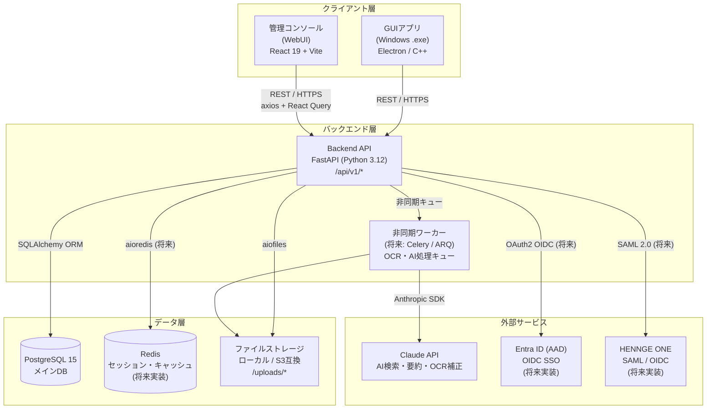
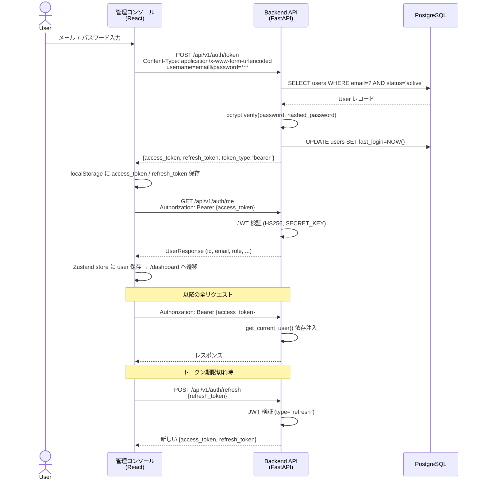
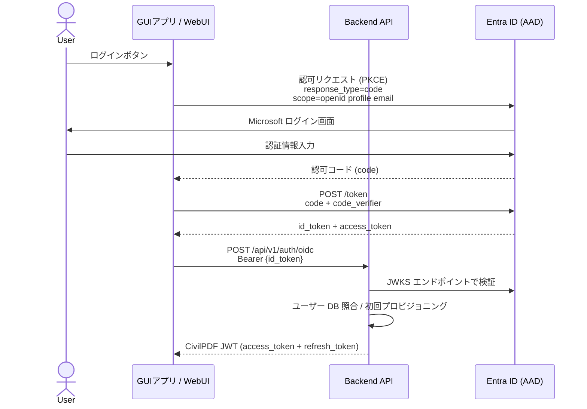
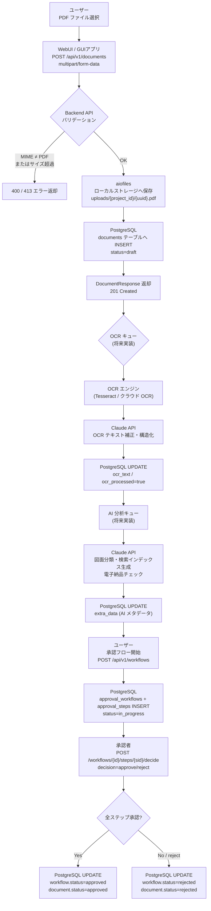

# CivilPDF-DX システム構成図

建設・土木業特化 PDF プラットフォームの全体アーキテクチャ定義書。

---

## 1. システム全体構成図



---

## 2. コンポーネント詳細

### 2.1 GUIアプリ（Windowsデスクトップ）

| 項目 | 内容 |
|---|---|
| 形態 | Windows 実行ファイル (.exe) |
| 責務 | PDF 閲覧・注釈・OCR・図面比較・電子印鑑・電子納品チェック・AI検索 |
| オフライン | ローカルキャッシュによるオフライン動作対応（同期パネルで競合解決） |
| 通信 | Backend API へ REST/HTTPS で接続 |
| 認証 | JWT Bearer トークン（将来: Entra ID OIDC PKCE） |
| 実装状況 | 計画中（MVP フェーズ外） |

### 2.2 管理コンソール（WebUI）

| 項目 | 内容 |
|---|---|
| フレームワーク | React 19 + Vite + TypeScript |
| 状態管理 | Zustand (認証状態) + TanStack Query v5 (サーバー状態) |
| HTTP クライアント | axios（`/src/console/frontend/src/api/client.ts`） |
| スタイリング | Tailwind CSS v3 |
| ルーティング | React Router v6 |
| 責務 | ユーザー・プロジェクト・ドキュメント・承認ワークフロー管理 |
| 実装状況 | MVP 完成済み（6 画面） |

### 2.3 Backend API

| 項目 | 内容 |
|---|---|
| フレームワーク | FastAPI (Python 3.12) |
| ORM | SQLAlchemy 2.x（同期モード） |
| バリデーション | Pydantic v2 |
| 認証 | JWT (HS256) — `python-jose` + `passlib[bcrypt]` |
| ファイル処理 | `aiofiles` による非同期 PDF 保存 |
| API バージョン | `/api/v1/` プレフィックス |
| CORS | `fastapi.middleware.cors.CORSMiddleware` |
| ドキュメント | Swagger UI (`/docs`)、ReDoc (`/redoc`) |
| ヘルスチェック | `GET /health` |
| 実装状況 | MVP 完成済み |

**実装済みルーター:**

| プレフィックス | タグ | 主要エンドポイント |
|---|---|---|
| `/api/v1/auth` | Authentication | `POST /token`, `POST /refresh`, `GET /me` |
| `/api/v1/users` | Users | `GET /`, `GET /{id}`, `POST /`, `PATCH /{id}` |
| `/api/v1/projects` | Projects | `GET /`, `POST /`, `GET /{id}`, `PATCH /{id}` |
| `/api/v1/documents` | Documents | `GET /`, `POST /` (multipart), `GET /{id}`, `PATCH /{id}`, `DELETE /{id}` |
| `/api/v1/workflows` | Approval Workflows | `POST /`, `GET /{id}`, `POST /{id}/steps/{sid}/decide` |

### 2.4 PostgreSQL

| 項目 | 内容 |
|---|---|
| バージョン | PostgreSQL 15 |
| 主要テーブル | `users`, `projects`, `documents`, `document_versions`, `approval_workflows`, `approval_steps` |
| マイグレーション | Alembic（本番）/ `Base.metadata.create_all`（開発時自動） |
| 接続 | SQLAlchemy 接続プール（`SessionLocal`） |

### 2.5 ファイルストレージ

| 項目 | 内容 |
|---|---|
| MVP | ローカルファイルシステム（`settings.upload_dir`、デフォルト `./uploads`） |
| 将来 | S3 互換オブジェクトストレージ（MinIO / AWS S3 / Azure Blob） |
| 構造 | `uploads/{project_id}/{uuid}.pdf` |
| 制限 | PDF のみ (`application/pdf`)、最大サイズ `settings.max_file_size_mb` MB |

### 2.6 AI / Claude API（将来実装）

| 項目 | 内容 |
|---|---|
| 用途 | OCR テキスト補正、自然言語検索、文書要約、Q&A、電子納品チェック支援 |
| 実装予定 | 非同期ワーカー経由で呼び出し（Celery / ARQ） |
| SDK | Anthropic Python SDK |

---

## 3. 認証フロー

### 3.1 現在の JWT 認証（MVP 実装済み）



### 3.2 将来の Entra ID OIDC 認証



---

## 4. データフロー

### 4.1 PDF アップロード → OCR → AI 分析 → 承認フロー



---

## 5. ネットワーク構成

### 5.1 対応デプロイ方式

```
オンプレミス構成（建設会社の社内サーバー）
┌─────────────────────────────────────────┐
│  社内 LAN / イントラネット                  │
│  ┌──────────┐  ┌──────────┐              │
│  │ WebUI    │  │ GUIアプリ │  ←  工事現場PC   │
│  │ (nginx)  │  │ (Windows) │              │
│  └─────┬────┘  └─────┬────┘              │
│        └──────┬───────┘                  │
│        ┌──────▼──────┐                   │
│        │  Backend API │                   │
│        │  (FastAPI)   │                   │
│        └──────┬───────┘                   │
│  ┌────────────┴──────────┐               │
│  │  PostgreSQL │  Files   │               │
│  └─────────────────────-─┘               │
└─────────────────────────────────────────┘
           ↑ HTTPS (自己署名 or 社内 CA)
    外部: Claude API / Entra ID のみ HTTPS 接続
```

### 5.2 ハイブリッド構成（クラウド連携）

| コンポーネント | オンプレ | クラウド |
|---|---|---|
| GUIアプリ | Windows クライアント PC | — |
| Backend API | 社内サーバー / Docker | Azure App Service |
| PostgreSQL | 社内 DB サーバー | Azure Database for PostgreSQL |
| ファイルストレージ | NAS / 社内ディスク | Azure Blob / AWS S3 |
| 認証 | JWT | Entra ID OIDC |
| AI API | — | Claude API (HTTPS) |

### 5.3 通信セキュリティ

| 経路 | プロトコル | 備考 |
|---|---|---|
| WebUI → API | HTTPS (TLS 1.2+) | CORS ホワイトリスト制限 |
| GUIアプリ → API | HTTPS (TLS 1.2+) | 証明書ピニング（将来） |
| API → PostgreSQL | TCP（社内ネットワーク） | 接続プール・暗号化オプション |
| API → Claude API | HTTPS | API キー認証 |
| API → Entra ID | HTTPS | JWKS 検証 |

---

## 6. デプロイ構成

### 6.1 Docker Compose（開発・MVP）

```yaml
# docker-compose.yml 構成イメージ
services:
  db:
    image: postgres:15-alpine
    volumes: [postgres_data:/var/lib/postgresql/data]
    environment: [POSTGRES_DB, POSTGRES_USER, POSTGRES_PASSWORD]

  backend:
    build: ./src/console/backend
    depends_on: [db]
    environment:
      - DATABASE_URL=postgresql://...
      - SECRET_KEY=...
      - UPLOAD_DIR=/app/uploads
    volumes: [uploads:/app/uploads]
    ports: ["8000:8000"]

  frontend:
    build: ./src/console/frontend
    ports: ["3000:80"]     # nginx で配信

  nginx:
    image: nginx:alpine
    ports: ["443:443", "80:80"]
    volumes: [./nginx.conf, ./certs]
```

### 6.2 Kubernetes（本番・将来）

```
Namespace: civilpdf-dx
├── Deployment: backend (FastAPI)  — replicas: 2+
├── Deployment: frontend (nginx)   — replicas: 2+
├── StatefulSet: postgresql         — PersistentVolumeClaim
├── Deployment: worker (Celery)    — OCR/AI 非同期処理
├── Service: backend-svc (ClusterIP)
├── Service: frontend-svc (ClusterIP)
├── Ingress: nginx-ingress (TLS 終端)
├── ConfigMap: app-config
├── Secret: db-secret, jwt-secret, claude-api-key
└── PersistentVolumeClaim: uploads-pvc
```

### 6.3 環境変数（必須設定）

| 変数名 | 用途 | 例 |
|---|---|---|
| `DATABASE_URL` | PostgreSQL 接続文字列 | `postgresql://user:pass@db:5432/civilpdf` |
| `SECRET_KEY` | JWT 署名鍵 | 32 バイト以上のランダム文字列 |
| `ACCESS_TOKEN_EXPIRE_MINUTES` | JWT 有効期限 | `30` |
| `REFRESH_TOKEN_EXPIRE_DAYS` | リフレッシュトークン有効期限 | `7` |
| `UPLOAD_DIR` | PDF 保存ディレクトリ | `/app/uploads` |
| `MAX_FILE_SIZE_MB` | PDF 最大サイズ | `100` |
| `CORS_ORIGINS` | CORS 許可オリジン | `https://console.example.com` |
| `CLAUDE_API_KEY` | Claude API キー（将来） | `sk-ant-...` |
| `AZURE_CLIENT_ID` | Entra ID クライアント ID（将来） | `xxxxxxxx-...` |
