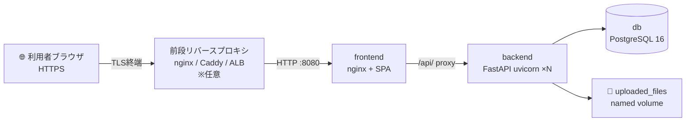

# 🚀 本番 Docker デプロイ手順書 — CivilPDF-DX

> Linux ホスト上で `docker compose` を用いて CivilPDF-DX を本番運用するための手順書です。
> Windows ネイティブ展開（NSSM + nginx）は [`windows-deployment.md`](../windows-deployment.md) を参照してください。
> 現行の SQLite 本番からの移行は [Neon/PostgreSQL 移行ガイド](neon-postgresql-migration.md)、秘密鍵管理は [secret-management.md](secret-management.md) を参照してください。

このスタックは 3 コンテナで構成されます。



| サービス | イメージ / ビルド | 公開 | 役割 |
|---|---|---|---|
| `db` | `postgres:16-alpine` | ❌ 内部のみ | 永続データ（named volume `postgres_data`） |
| `backend` | `src/console/backend/Dockerfile` | ❌ 内部のみ | FastAPI（uvicorn ×N worker）+ Alembic migration |
| `frontend` | `src/console/frontend/Dockerfile.prod` | ✅ `${FRONTEND_PORT:-8080}` | SPA 静的配信 + `/api/` リバースプロキシ |

> 🔒 **設計方針**: `db` / `backend` のポートはホストに公開しません。外部からの入口は `frontend`（既定 8080）のみで、API は frontend nginx の `/api/` プロキシ経由で到達します。HTTPS は前段の TLS リバースプロキシで終端してください。

---

## 📌 1. 前提条件

| 項目 | 要件 |
|---|---|
| OS | Linux（Ubuntu 22.04+ / RHEL 9+ 等） |
| Docker Engine | 24.0 以上 |
| Docker Compose | v2（`docker compose` サブコマンド） |
| CPU / RAM | 2 vCPU / 4 GB 以上を推奨 |
| ディスク | アップロード PDF 量に応じて確保（named volume） |
| ネットワーク | 利用者からフロントエンド公開ポートへ到達可能 |

```bash
docker --version          # Docker version 24.x 以上
docker compose version    # Docker Compose version v2.x 以上
```

---

## 📌 2. リポジトリ取得

```bash
git clone https://github.com/Kensan196948G/CivilPDF-DX.git
cd CivilPDF-DX
git checkout main
```

---

## 📌 3. 環境変数（`.env`）の作成

本番テンプレートをコピーして編集します。`.env` は `.gitignore` 済みです。

```bash
cp .env.prod.example .env
```

### 3.1 必須項目（未設定だと起動失敗 or 脆弱）

| 変数 | 説明 | 生成例 |
|---|---|---|
| `POSTGRES_PASSWORD` | DB パスワード（未設定だと compose が起動を拒否） | `openssl rand -hex 24` |
| `SECRET_KEY` | JWT 署名鍵 | `openssl rand -hex 32` |
| `TIMESTAMP_HMAC_KEY` | RFC 3161 ローカルタイムスタンプ署名鍵（既定値のままは脆弱） | `openssl rand -hex 32` |
| `CORS_ORIGINS` | 公開オリジンの JSON 配列 | `["https://pdf.example.co.jp"]` |

```bash
# 一括生成の例
echo "POSTGRES_PASSWORD=$(openssl rand -hex 24)"
echo "SECRET_KEY=$(openssl rand -hex 32)"
echo "TIMESTAMP_HMAC_KEY=$(openssl rand -hex 32)"
```

### 3.2 任意項目

| 変数 | 用途 |
|---|---|
| `ANTHROPIC_API_KEY` | Claude AI（文書分類 / セマンティック検索 / 要約 / 構造抽出） |
| `M365_FERNET_KEY` | Microsoft 365 client_secret の DB 暗号化鍵 |
| `M365_ALLOWED_NETWORKS` | M365 ログイン許可ネットワーク（CIDR, カンマ区切り） |
| `TSA_URL` | 外部 RFC 3161 TSA（未設定ならローカル HMAC にフォールバック） |
| `FRONTEND_PORT` | フロントエンド公開ポート（既定 8080） |
| `UVICORN_WORKERS` | backend ワーカープロセス数（目安: 2 × CPU コア） |

> 🔑 Microsoft 365 の `tenant_id` / `client_id` / `client_secret` は環境変数ではなく、起動後に管理 API/UI（`PATCH /api/v1/m365/settings`）で設定し DB に暗号化保存します。

---

## 📌 4. ビルドと起動

```bash
# ビルド + バックグラウンド起動
docker compose -f docker-compose.prod.yml up -d --build

# 状態確認（全サービス healthy になるまで待つ）
docker compose -f docker-compose.prod.yml ps

# ログ追従
docker compose -f docker-compose.prod.yml logs -f backend
```

起動時、`backend` は `alembic upgrade head` を自動実行してから uvicorn を起動します（マイグレーションは冪等）。

---

## 📌 5. 初回管理者ユーザーの作成

backend コンテナ内でスクリプトを実行します。

```bash
docker compose -f docker-compose.prod.yml exec backend \
  python /app/../scripts/create_admin.py 2>/dev/null || \
docker compose -f docker-compose.prod.yml exec -w /app backend \
  sh -c "PYTHONPATH=/app python - <<'PY'
# create_admin 相当: 既存スクリプトが backend 配下に無い場合の最小フォールバックは
# リポジトリの scripts/create_admin.py を参照
PY"
```

> ℹ️ `scripts/create_admin.py` はリポジトリ直下にあります。コンテナには backend ディレクトリのみが入るため、管理者作成はホスト側の Python で DB に対して実行するか、スクリプトをコンテナにコピーして実行してください。
>
> ```bash
> # ホスト側から（PostgreSQL に到達できる環境で）
> docker compose -f docker-compose.prod.yml cp scripts/create_admin.py backend:/app/create_admin.py
> docker compose -f docker-compose.prod.yml exec -w /app backend python create_admin.py
> ```
>
> 既定の管理者: `admin@example.com` / `AdminPass123!` → **初回ログイン後に必ずパスワードを変更**してください。

---

## 📌 6. 動作確認

```bash
# フロントエンド（SPA）
curl -I http://localhost:8080/

# backend health（frontend nginx 経由）
curl http://localhost:8080/health
# => {"status":"ok","app":"CivilPDF-DX","version":"..."}

# API（frontend nginx の /api/ プロキシ経由）
curl -i http://localhost:8080/api/v1/  # 認証が必要なエンドポイントは 401 が正常
```

ブラウザで `http://<ホスト>:8080/` を開き、管理者でログインできることを確認します。

---

## 📌 7. TLS / HTTPS（推奨）

frontend は HTTP(:80→公開8080) のみを提供します。本番では前段に TLS 終端のリバースプロキシを置いてください。

<details>
<summary>前段 nginx の最小例</summary>

```nginx
server {
    listen 443 ssl;
    server_name pdf.example.co.jp;

    ssl_certificate     /etc/ssl/certs/pdf.example.co.jp.crt;
    ssl_certificate_key /etc/ssl/private/pdf.example.co.jp.key;

    client_max_body_size 100m;

    location / {
        proxy_pass http://127.0.0.1:8080;
        proxy_set_header Host              $host;
        proxy_set_header X-Real-IP         $remote_addr;
        proxy_set_header X-Forwarded-For   $proxy_add_x_forwarded_for;
        proxy_set_header X-Forwarded-Proto $scheme;
    }
}
server {
    listen 80;
    server_name pdf.example.co.jp;
    return 301 https://$host$request_uri;
}
```
</details>

> HTTPS の公開オリジンを `.env` の `CORS_ORIGINS` に追加してから再起動してください。

---

## 📌 8. バックアップ

| 対象 | 方法 |
|---|---|
| データベース | `docker compose -f docker-compose.prod.yml exec db pg_dump -U civilpdf civilpdf > backup_$(date +%F).sql` |
| アップロードファイル | named volume `uploaded_files` を `docker run --rm -v civilpdf-dx_uploaded_files:/data -v $PWD:/backup alpine tar czf /backup/uploads_$(date +%F).tar.gz -C /data .` |

> 📋 監査チェーン（SHA-256 ハッシュチェーン）と保持ポリシー（電子帳簿保存法 7 年）が有効なため、DB バックアップは法的証跡として定期取得してください。volume 名は `docker volume ls` で確認できます（プロジェクト名プレフィックスが付きます）。

---

## 📌 9. 運用コマンド

```bash
# 更新デプロイ（main 取得 → 再ビルド → ローリング再起動）
git pull origin main
docker compose -f docker-compose.prod.yml up -d --build

# 停止（データは volume に保持）
docker compose -f docker-compose.prod.yml down

# 完全削除（⚠️ volume も削除＝データ消失）
docker compose -f docker-compose.prod.yml down -v

# マイグレーション状態の確認
docker compose -f docker-compose.prod.yml exec -w /app backend alembic current
```

### 物理削除ジョブ（GDPR Art.17 / 電子帳簿保存法）

削除要求から猶予期間（既定 30 日）経過した文書を物理削除するジョブを cron で定期実行します。

```bash
# 例: 毎日 03:00 に実行（host crontab）
0 3 * * * docker compose -f /opt/CivilPDF-DX/docker-compose.prod.yml exec -T -w /app backend \
  python -c "from database import SessionLocal; from services.deletion_job import run_deletion_job; db=SessionLocal(); print(run_deletion_job(db)); db.close()"
```

---

## 📌 10. トラブルシューティング

| 症状 | 原因 / 対処 |
|---|---|
| `POSTGRES_PASSWORD is required` で起動失敗 | `.env` に `POSTGRES_PASSWORD` を設定 |
| backend が `unhealthy` のまま | `logs backend` で Alembic / DB 接続を確認。`db` が healthy か確認 |
| ログイン後すぐ 401 | `SECRET_KEY` を変更して再起動するとトークン無効化される（再ログイン） |
| アップロードが 413 | 前段プロキシ / nginx の `client_max_body_size` と `MAX_FILE_SIZE_MB` を確認 |
| AI 機能が 503/未動作 | `ANTHROPIC_API_KEY` 未設定。`.env` に設定し再起動 |
| タイムスタンプ署名が弱い警告 | `TIMESTAMP_HMAC_KEY` が既定値のまま。ランダム値に変更 |

---

## ✅ デプロイ前チェックリスト

- [ ] `.env` を `.env.prod.example` から作成し、`POSTGRES_PASSWORD` / `SECRET_KEY` / `TIMESTAMP_HMAC_KEY` をランダム生成値に設定した
- [ ] `CORS_ORIGINS` を本番公開オリジンに設定した
- [ ] `docker compose -f docker-compose.prod.yml ps` で 3 サービスすべて `healthy`
- [ ] 初回管理者を作成し、既定パスワードを変更した
- [ ] 前段リバースプロキシで HTTPS を終端した
- [ ] DB / uploads のバックアップ手順を cron 等に登録した
- [ ] （任意）`ANTHROPIC_API_KEY` / `M365_FERNET_KEY` / `TSA_URL` を設定した
