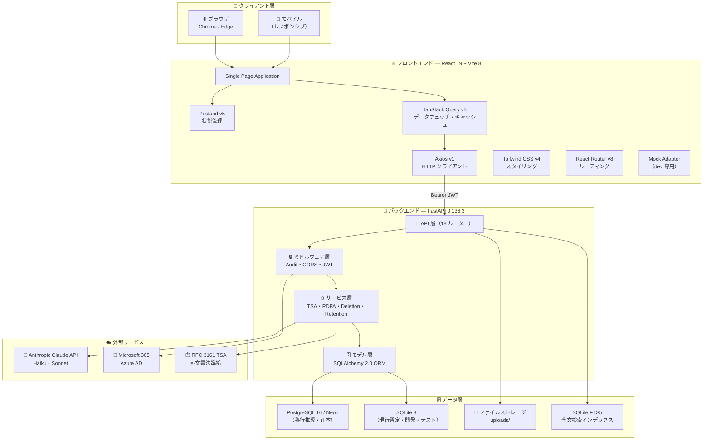
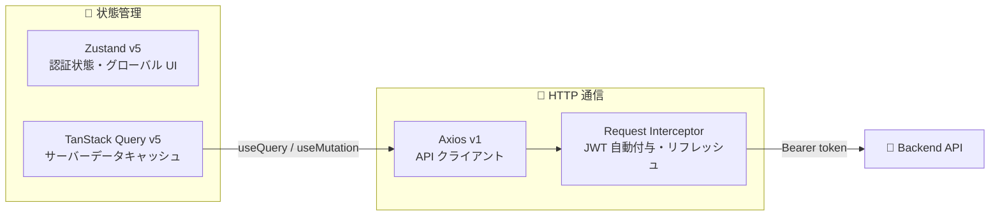
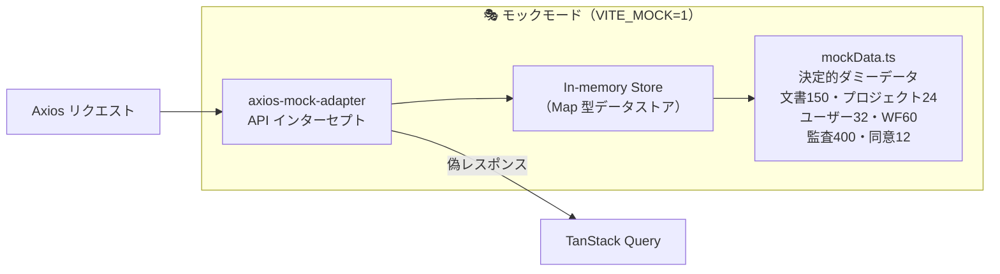
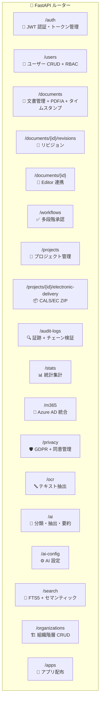
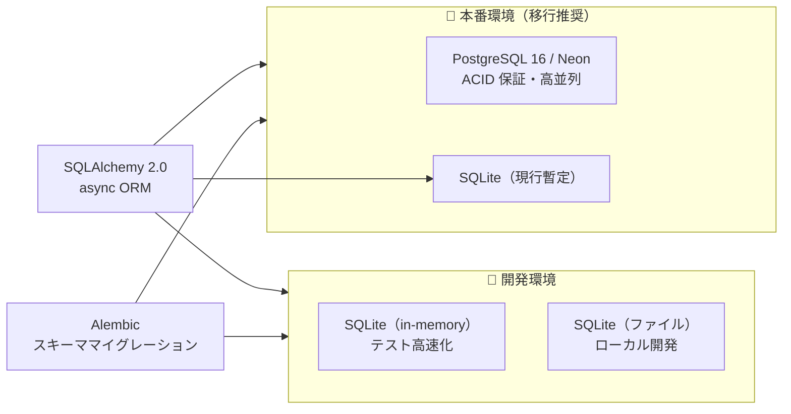
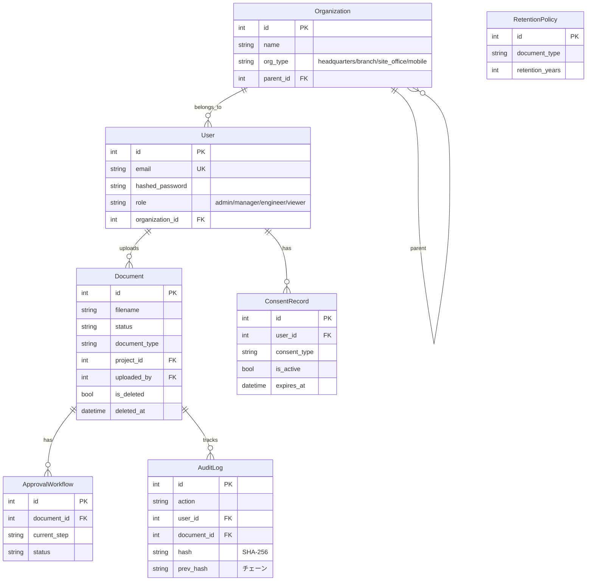
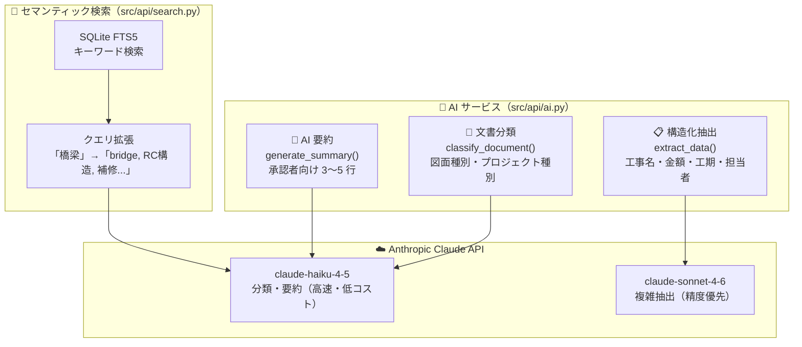
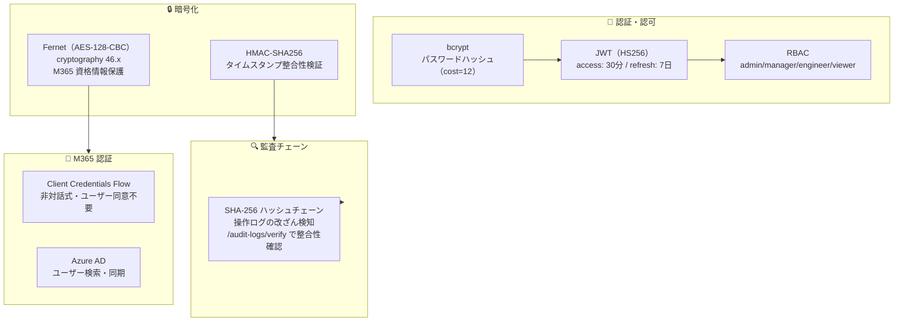
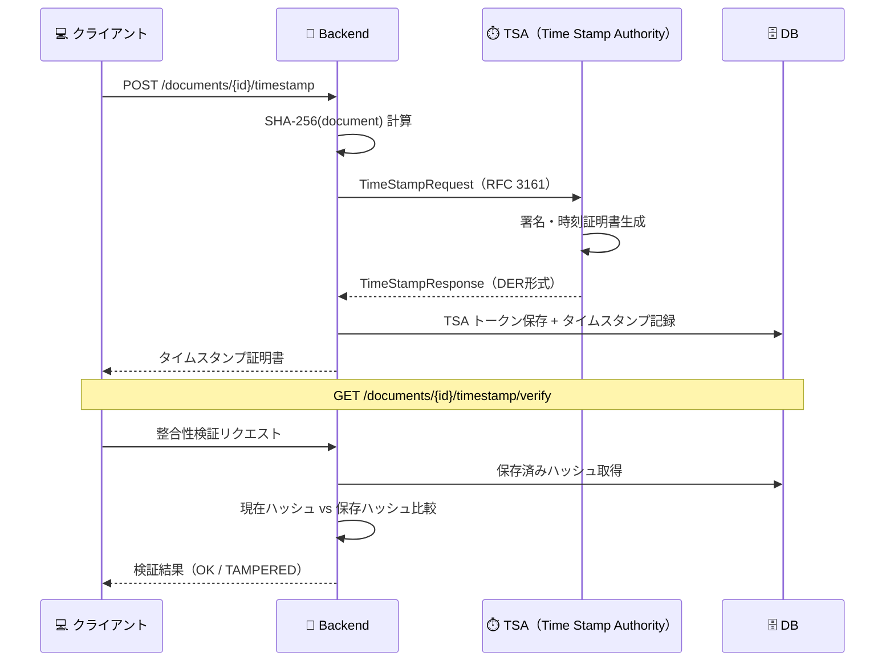
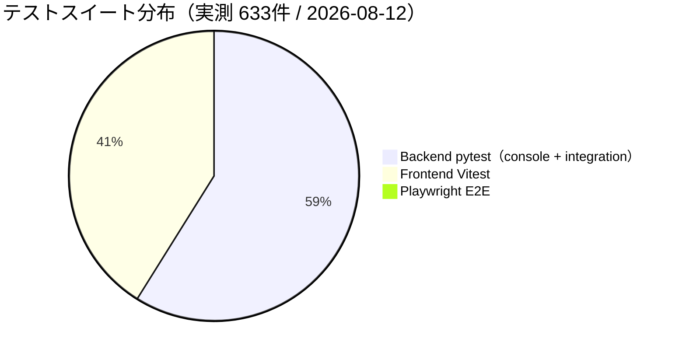

# 🔧 技術スタック詳細 — CivilPDF-DX

> **対象者**: 開発者・エンジニア・技術評価担当者  
> 非エンジニア向け概要は [README.md](../README.md) を参照してください。  
> IT 部門向けセットアップは [docs/for-it-staff.md](for-it-staff.md) を参照してください。

---

## 📌 目次

1. [アーキテクチャ概観](#-アーキテクチャ概観)
2. [フロントエンド](#-フロントエンド)
3. [バックエンド](#-バックエンド)
4. [データ層](#️-データ層)
5. [AI・機械学習](#-ai機械学習)
6. [セキュリティ・暗号化](#-セキュリティ暗号化)
7. [コンプライアンス技術](#️-コンプライアンス技術)
8. [テスト戦略](#-テスト戦略)
9. [CI/CD](#️-cicd)
10. [コードレビュー体制](#-コードレビュー体制)
11. [依存関係一覧](#-依存関係一覧)
12. [設計判断記録（ADR）](#-設計判断記録adr)

---

## 🏗️ アーキテクチャ概観



---

## ⚛️ フロントエンド

### コアフレームワーク

| 技術                | バージョン | 選定理由                                     |
| ------------------- | ---------- | -------------------------------------------- |
| ⚛️ **React**        | 19.2.x     | Concurrent Features・Suspense による UX 向上 |
| 🔷 **TypeScript**   | ~6.0.x     | 型安全性・IDE 補完・大規模コード品質維持     |
| ⚡ **Vite**         | 8.x        | 高速 HMR・ES Modules ネイティブ・本番最適化  |
| 🎨 **Tailwind CSS** | v4         | ユーティリティファースト・ゼロランタイムCSS  |

### 状態管理・データフェッチ



| 技術                  | バージョン | 用途                                                        |
| --------------------- | ---------- | ----------------------------------------------------------- |
| 🐻 **Zustand**        | v5         | 認証状態・グローバル UI 状態                                |
| 🔄 **TanStack Query** | v5         | サーバーデータのキャッシュ・同期・ページネーション          |
| 📡 **Axios**          | v1         | HTTP クライアント（JWT インターセプター・自動リフレッシュ） |
| 🛣️ **react-router**  | v8         | クライアントサイドルーティング・認証ガード                  |
| 🗺️ **@tanstack/react-router** | v1 | TanStack Router（package.json 上は依存として同梱） |

### フロントエンド構成（Enterprise シェル 15 ビュー + ログイン）

`App.tsx` のルートは `/login` と、認証必須の Enterprise シェル（`components/enterprise/EnterpriseLayout.tsx`）です。シェル内は内部ステートでビューを切替えます。

```
src/pages/                    # API 接続済みページ
├── Login.tsx                 # 🔐 ログイン
├── Documents.tsx             # 📄 図書管理
├── Projects.tsx              # 🏗️ プロジェクト
├── Workflows.tsx             # ✅ 承認ワークフロー
├── AuditLogs.tsx             # 🔍 監査ログ
├── Users.tsx                 # 👥 ユーザー管理
└── Settings.tsx              # ⚙️ システム設定

src/components/enterprise/views/
├── LandingView.tsx           # 🏠 概要
├── DashboardView.tsx         # 📊 ダッシュボード（overview/stats/dist/users）
├── UploadView.tsx            # 📤 取込/解析
├── ViewerView.tsx            # 👁️ ビューア
├── AppsView.tsx              # 📱 アプリ配布
├── EditorSyncView.tsx        # 🔗 Editor連携
├── SecurityView.tsx          # 🔒 セキュリティ
├── M365View.tsx              # 🏢 Microsoft365
└── PrivacyView.tsx           # 🛡️ プライバシー
```

### モックアーキテクチャ（dev 専用）



> ✅ `import.meta.env.DEV` 必須条件 → 本番ビルドに混入しない（Vite tree-shaking）

---

## 🐍 バックエンド

### コアフレームワーク

| 技術            | バージョン | 選定理由                                              |
| --------------- | ---------- | ----------------------------------------------------- |
| 🚀 **FastAPI**  | 0.136.3    | async/await ネイティブ・型ヒント自動 OpenAPI 生成     |
| 🐍 **Python**   | 3.12       | 最新パフォーマンス改善・型システム強化                |
| ⚡ **uvicorn**  | 0.32.1     | ASGI サーバー・高スループット                         |
| ✅ **Pydantic** | 2.10.x     | 高速バリデーション・シリアライゼーション（Rust コア） |

### API 構成（18 ルーター）



### ミドルウェアスタック

```
Request
  ↓
CORSMiddleware（オリジン制限）
  ↓
AuditMiddleware（全書き込みを自動記録 + SHA-256 チェーン）
  ↓
JWT 認証 Depends（ルート別 RBAC チェック）
  ↓
Router Handler
  ↓
Response
```

---

## 🗄️ データ層

### データベース戦略



| 技術               | バージョン | 用途                                                     |
| ------------------ | ---------- | -------------------------------------------------------- |
| 🗄️ **SQLAlchemy**  | 2.0.36     | async ORM・マッパー・クエリビルダー                      |
| 📋 **Alembic**     | 1.14.0     | スキーマバージョン管理・ゼロダウンタイムマイグレーション |
| 🐘 **PostgreSQL**  | 16         | 本番 DB 正本（移行推奨・Neon 可。全文検索は FTS/tsvector 設計） |
| 🗄️ **SQLite**     | 3.x        | 現行本番の暫定 DB・開発/テスト。移行完了まで運用継続     |
| 🔍 **SQLite FTS5** | 組み込み   | 日本語全文検索（unicode61 トークナイザー）               |

### データモデル（主要テーブル）



---

## 🤖 AI・機械学習

### Claude API 統合



| 機能                    | モデル            | 平均レイテンシ目安 |
| ----------------------- | ----------------- | ------------------ |
| 🏷️ **図面種別分類**     | claude-haiku-4-5  | ~1.5秒             |
| 📋 **構造化データ抽出** | claude-sonnet-4-6 | ~3秒               |
| 📝 **承認者向け要約**   | claude-haiku-4-5  | ~2秒               |
| 🔎 **検索クエリ拡張**   | claude-haiku-4-5  | ~1秒               |

---

## 🔐 セキュリティ・暗号化

### 暗号化・認証技術スタック



| 技術                   | バージョン | 用途                                     |
| ---------------------- | ---------- | ---------------------------------------- |
| 🔑 **python-jose**     | 3.5.0      | JWT 署名・検証（HS256）                  |
| 🔒 **bcrypt**          | 4.2.1      | パスワードハッシュ（bcrypt cost=12）     |
| 🛡️ **cryptography**    | 50.0.0     | Fernet 対称暗号（M365 シークレット保護） |
| 🔗 **hashlib**         | 組み込み   | SHA-256 監査チェーン生成                 |

> ⚠️ M365 認証は現状 **Client Credentials Flow の非対話ブリッジ**です。Entra ID OIDC SSO（要件 WEB-AUTH-002）は未実装のため、要件上は将来課題として管理しています。

---

## 🏛️ コンプライアンス技術

### RFC 3161 電子タイムスタンプ



### 電子納品 CALS/EC 準拠

```
生成される ZIP 構造（国交省電子納品要領準拠）:
電子納品_{プロジェクト名}_{日時}/
├── INDEX.XML              ← 目次 XML（文書管理情報）
├── DRAWINGS/              ← 図面フォルダ
│   ├── 01_平面図.pdf
│   └── 02_断面図.pdf
├── SPECIFICATIONS/        ← 仕様書フォルダ
│   └── 工事仕様書.pdf
└── REPORTS/              ← 報告書フォルダ
    └── 施工報告書.pdf
```

| 法令・規格                | 実装                                                     |
| ------------------------- | -------------------------------------------------------- |
| ⚖️ **e-文書法**           | RFC 3161 TSA トークン生成・ファイル整合性検証（SHA-256） |
| 📦 **CALS/EC 電子納品**   | INDEX.XML 自動生成・フォルダ構成準拠・ワンクリック ZIP   |
| 📋 **電子帳簿保存法**     | 書類種別別保持期間 DB 管理・自動パージ禁止フラグ         |
| 🌍 **GDPR Art.17**        | 削除リクエスト受理 → 論理削除 → 物理削除バッチ（7日後）  |
| 📄 **PDF/A（ISO 14289）** | pypdf + veraPDF フォールバックによる準拠チェック         |

---

## 🧪 テスト戦略

### テスト構成と分布



```mermaid
graph TB
    subgraph BACKEND_TEST["🐍 Backend テスト（pytest）"]
        UNIT["🧪 ユニットテスト\n351件\nSQLite in-memory\nカバレッジ目標 80% 以上"]
        INTEGRATION["🔗 E2E 統合テスト\n20件\n認証・文書・承認・GDPR・RBAC"]
    end

    subgraph FRONTEND_TEST["⚛️ Frontend テスト"]
        VITEST["⚡ Vitest\n259件\nコンポーネント + シェル統合\njsdom 環境"]
        PLAYWRIGHT["🎭 Playwright E2E\n3件\n実ブラウザ（chromium）\n本番ビルド + API モック"]
    end

    subgraph CI_TEST["🔄 CI テスト（GitHub Actions）"]
        UNIT --> CI_TEST
        INTEGRATION --> CI_TEST
        VITEST --> CI_TEST
        PLAYWRIGHT --> CI_TEST
    end
```

| スイート              | 件数       | カバレッジ         | 実行環境            |
| --------------------- | ---------- | ------------------ | ------------------- |
| 🐍 Backend pytest     | 371 件（console 351 + integration 20） | 目標 80% 以上 | SQLite（in-memory / ファイル） |
| ⚡ Vitest（Frontend） | 259 件     | —                  | jsdom               |
| 🎭 Playwright E2E     | 3 件       | —                  | Chromium 実ブラウザ |
| **合計**              | **633 件** | —                  | —                   |

---

## ⚙️ CI/CD

### パイプライン構成（GitHub Actions）

```yaml
# .github/workflows/ci.yml の概要構成
jobs:
  backend-lint: # ruff check + ruff format --check
  backend-test: # pytest 351件（SQLite）+ カバレッジ閾値
  backend-security: # pip-audit 脆弱性スキャン
  frontend-lint-test: # ESLint + Vitest 259件 + tsc --noEmit + build
  frontend-security: # npm audit
  secret-scan: # gitleaks
  ops-checks: # bash -n + バージョン整合チェック
  frontend-e2e: # Playwright 3件（chromium）
  integration-test: # pytest 20件（API E2E）
```

### デプロイゲート

```
feat/branch → Pull Request → CI 全ジョブ成功必須 → main merge
main → （手動） → Docker build → 本番サーバーへ
```

---

## 🔍 コードレビュー体制

| ツール                | 役割                                | タイミング            |
| --------------------- | ----------------------------------- | --------------------- |
| 🐰 **CodeRabbit**     | 静的解析（40+ 解析器）+ AI レビュー | PR 作成時・自動       |
| 🛡️ **Codex Review**   | 設計・ロジックの深いレビュー        | Verify フェーズ・手動 |
| ✅ **GitHub Actions** | lint・test・security の自動実行     | push・PR 時           |

---

## 📦 依存関係一覧

### バックエンド（requirements.txt 主要）

| パッケージ                  | バージョン | 用途                       |
| --------------------------- | ---------- | -------------------------- |
| `fastapi`                   | 0.136.3    | Web フレームワーク         |
| `uvicorn[standard]`         | 0.32.1     | ASGI サーバー              |
| `sqlalchemy`                | 2.0.36     | ORM                        |
| `alembic`                   | 1.14.0     | マイグレーション           |
| `pydantic`                  | 2.10.3     | バリデーション             |
| `python-jose[cryptography]` | 3.5.0      | JWT                        |
| `bcrypt`                    | 4.2.1      | パスワードハッシュ         |
| `cryptography`              | 50.0.0     | Fernet 暗号化              |
| `anthropic`                 | >=0.40.0   | Claude AI API              |
| `pypdf`                     | >=6.12.0   | PDF 処理・テキスト抽出     |
| `aiofiles`                  | 24.1.0     | 非同期ファイル I/O         |
| `httpx`                     | 0.28.1     | M365 API HTTP クライアント |
| `psycopg2-binary`           | 2.9.10     | PostgreSQL ドライバー      |
| `starlette`                 | 1.3.1      | ASGI フレームワーク        |
| `msal`                      | 1.37.0     | Microsoft Entra ID SDK     |

### フロントエンド（package.json 主要）

| パッケージ              | バージョン | 用途                         |
| ----------------------- | ---------- | ---------------------------- |
| `react`                 | 19.2.x     | UI フレームワーク            |
| `typescript`            | ~6.0.x     | 型システム                   |
| `vite`                  | 8.0.x      | ビルドツール                 |
| `@tanstack/react-query` | v5         | データフェッチ               |
| `zustand`               | v5         | 状態管理                     |
| `axios`                 | 1.19.x     | HTTP クライアント            |
| `react-router`          | 8.3.x      | ルーティング                 |
| `@tanstack/react-router`| 1.169.x    | ルーティング（同梱）         |
| `tailwindcss`           | v4         | スタイリング                 |
| `vitest`                | 4.1.x      | ユニットテスト               |
| `@playwright/test`      | 1.60.x     | E2E テスト                   |
| `eslint`                | 10.2.x     | Lint                         |

---

## 📋 設計判断記録（ADR）

### ADR-001: SQLite → PostgreSQL 移行戦略

- **決定**: 開発・テストは SQLite。本番の正本は PostgreSQL 16 / Neon へ移行（2026-08-12 時点では本番は SQLite の暫定運用）
- **理由**: 開発環境の簡便性 + 本番の ACID 保証・スケーラビリティ。利用前提の「DB 正本は Neon PostgreSQL」を満たすため
- **トレードオフ**: SQLite の FTS5 全文検索は PostgreSQL では tsvector 等へ置換が必要。移行手順は [docs/deployment/neon-postgresql-migration.md](deployment/neon-postgresql-migration.md)

### ADR-002: JWT ステートレス認証

- **決定**: セッション DB を持たず JWT のみで認証
- **理由**: スケールアウト容易・インフラシンプル化
- **トレードオフ**: ログアウト即時無効化不可（refresh token revocation リスト実装で対処予定）

### ADR-003: Claude Haiku / Sonnet モデル選択

- **決定**: 分類・要約は Haiku、複雑抽出は Sonnet
- **理由**: コスト最適化（Haiku は Sonnet の 1/5 コスト）
- **トレードオフ**: Haiku の精度は Sonnet より劣るが、分類・要約タスクでは十分

### ADR-004: モックアーキテクチャを dev 専用に限定

- **決定**: `import.meta.env.DEV` 必須条件でモックをバンドル除外
- **理由**: 認証バイパスが本番に混入するセキュリティリスク防止（Codex Review High 指摘対応）
- **実装**: `client.ts` で動的 import + Vite tree-shaking で本番バンドルから除外確認済み

### ADR-005: SHA-256 ハッシュチェーン監査ログ

- **決定**: 全書き込み操作を prev_hash → 現在レコードの hash チェーンで連結
- **理由**: ログ改ざん検知・監査法人への証明力強化（e-文書法準拠）
- **トレードオフ**: 書き込み時にハッシュ計算コスト発生（許容範囲内）

---

## 🔗 関連ドキュメント

| 文書                    | リンク                                                                          |
| ----------------------- | ------------------------------------------------------------------------------- |
| 📋 非エンジニア向け概要 | [README.md](../README.md)                                                       |
| 🖥️ IT 部門向けガイド    | [docs/for-it-staff.md](for-it-staff.md)                                         |
| 🏗️ システム構成図       | [docs/architecture/system-architecture.md](architecture/system-architecture.md) |
| 🌐 API リファレンス     | [docs/api/README.md](api/README.md)                                             |
| 🗄️ DB 設計書            | [docs/database-design.md](database-design.md)                                   |
| 📋 要件定義書           | [docs/requirements.md](requirements.md)                                         |
| 🐘 Neon/PostgreSQL 移行  | [docs/deployment/neon-postgresql-migration.md](deployment/neon-postgresql-migration.md) |
| 🔑 秘密鍵管理・ローテーション | [docs/deployment/secret-management.md](deployment/secret-management.md)     |
| 🔢 バージョン管理       | [docs/deployment/version-management.md](deployment/version-management.md)       |

---

_最終更新: 2026-08-12 | CivilPDF-DX Production Readiness 評価 / 運用文書更新_
